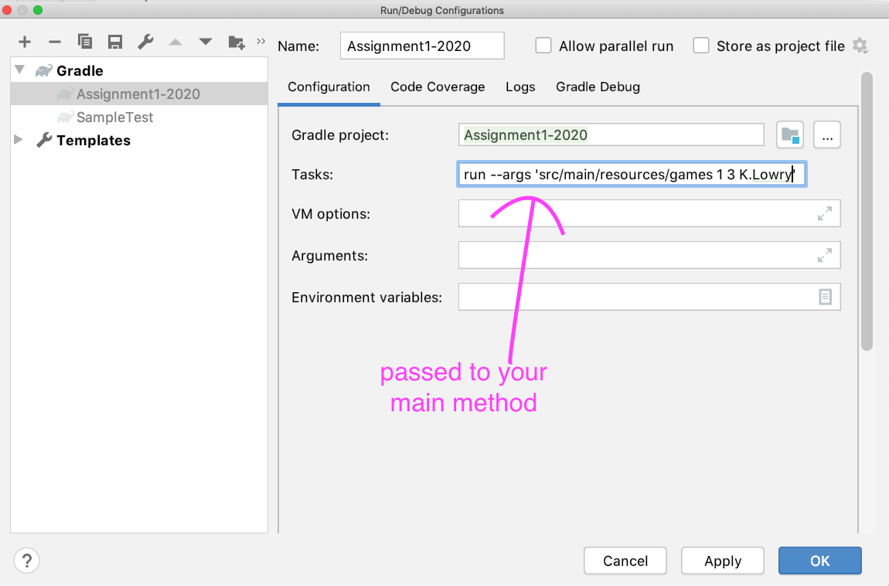

# CS 2910 - Assignment 1 Shooting Streaks

Find included in this assignment a number of data files in the `src/main/resources/games` directory. Specifically there are 82 data files. One for each of the Toronto Raptors Basketball games in the 2018-2019 season.

For example: game6.txt is the data file associated with the Toronto Raptor's 6th game of the season.

The data files contain a number of lines where each line is a shot that occurred during the game (the lines are in order of the shot's occurrence in the game). For example: the first line of `game6.txt` gives information about the first shot in game 6 and is as follows:

`K.Lowry,TOR,miss,3`

The first field in this comma separated line of fields is the player's name, in this case `K.Lowry` this is followed by the team the player plays for, in this case, `TOR` (Toronto Raptors), followed by whether the shot went in (`make`) or did not (`miss`), this shot did not go in. Finally the point value of the shot is the last field, in this case it was a 3 point attempt (worth 3 points). There are 3 shot values in NBA basketball 3 points, 2 points or 1 point shots.

Your task is to analyze the data-files and report the *longest* shooting streaks for players in a given game, or in the whole season. A streak can either be a streak of missed (`miss`) shots, or a streak of made (`make`) shots. Where a streak is the number of consecutive missed or made shots of that particular type in a row. For this assignment we'll be concerned with the longest of such streaks in a game (or a season).

For example if the game file contains the following:


`K.Lowry,TOR,miss,3`

`K.Lowry,TOR,make,2`

`K.Lowry,TOR,miss,3`

`K.Lowry,TOR,miss,3`

`K.Lowry,TOR,make,2`


If we examine only 3 point shots in the above we can conclude the longest streaks that K.Lowry had are a streak of 3 missed shots in a row and a streak of 0 made shots in a row. If however we examine all shot types (1,2 and 3 point shots) then we conclude K.Lowry had a long streak of 2 missed shots in a row and a long streak of 1 made 1 shot in a row.

In this assignment one part may have you process data from 82 games in a row (a whole season). In that case you pretend the game never stopped and so if a player finished the last game with a streak of 3 shots in a row, they start the next game by continuing that same streak.

For example if the first game contains the above and the next game contains the below:

`K.Lowry,TOR,make,2`

`K.Lowry,TOR,miss,3`

We conclude that K.Lowry's longest make streak for any shots is 2 shots in a row.

Note: If a player had either no missed shots or no made shots in a game your program should output 0 for their appropriate longest streak.

Your program will take input as program arguments (passed into the `main` method of the provided `ShootingStreak` class). The arguments will be a space separated list of Strings exactly as follows:

1. Location of the data files
2. Game number or all (for the game you want to calculate the shooting streak for)
3. Shot type (1, 2 or 3) or any if you want to analyze all of the shots
4. A space separated list of player names that you want to print the longest shooting streak of missed and made shots for.

For example If you wanted to *Analyze Shooting streaks for any shot type from game 1 for S.Ibaka and N.Powell* you would pass the following to your program:

`src/main/resources/games 1 any S.Ibaka N.Powell` from the command line this looks like this:

`java ShootingStreak src/main/resources/games 1 any S.Ibaka N.Powell`

From Gradle this looks like this:

`gradle run --args 'src/main/resources/games 1 any S.Ibaka N.Powell'`


In IntelliJ under the `run` menu you can choose `Run ...` then Edit Configurations and the plus + sign to add a new Gradle configuration with the above arguments. For example:



# Program Output

Your program should output 2 things.

1. Echo the arguments

Your program should simply echo to the console the exact arguments that were passed to your program. For example if your program is run with:

`gradle run --args 'src/main/resources/games 1 any S.Ibaka'`

The first line of output from your program should be:

`src/main/resources/games 1 any S.Ibaka`

2. A simple text table with a header giving the longest streak of missed shots and longest streak of made shots for each player in the argument list.

The table must match exactly as follows a header with the following:

`Player Longest_Misses Longest_Makes`

Followed by  line for each player:
S.Ibaka 4 4
N.Powell 1 2

The full expected output for your program on arguments:

`src/main/resources/games 1 any S.Ibaka N.Powell`

is:

```
src/main/resources/games 1 any S.Ibaka N.Powell

Player Longest_Misses Longest_Makes

S.Ibaka 4 4

N.Powell 1 2
```


There are a few sample unit-tests provided for you. Please keep in mind the grader will run a full set of tests on your program.


# Deliverables:

1. 1 point: Echo program arguments to Console - **Due Date: September 28 11:59pm.**

Note this is due prior to the final due date for the assignment

Note: You do not need to have a completed program - but the program you have checked into GitHub at this due date must pass the unit-tests associated with echoing the program arguments back to screen

2. 9 Points Final Deliverable - **Due Date: October 9 11:59pm**

The 9 points are broken down as follows:

 - 2 points: Code readability and coding standards
             - are variables named appropriately
             - are brackets consistent
             - are methods named appropriately
             - does every method and class have comments at the top, including any parameters
             - are proper variable names favored over excessive and unmaintainable inline commenting
             - are git commit messages appropriate and make sense
 - 3 points: Code Design
             - are your algorithms efficient
             - are all methods less than 50 lines of code
             - are classes and methods used appropriately
             - did you segment code into methods and classes with
             limited scope keeping maintainability, reusability and robustness in mind

  - 4 points: Functionality
             - Do all test cases pass
             - Test case results should become available when you check code into github.
             - You can check your code in as many times as you like prior to the deadline.     


Your submission is through github - and must be completed before the above due date(s).

*Late submissions will be accepted up to 24 hours after the due date* - there is a **30 percent deduction** for late submissions. After 24 hours after the due date submissions will receive a grade of 0.**

Note: This is an individual assignment. You are not permitted to share your code with any student. You are not permitted to submit code that is not 100 percent your own work. You are not allowed to collaborate with anyone on this assignment. 

See UPEI Academic Regulation 20 or contact the course instructor if you have any questions regarding academic honesty. Cheating detection software will be used as part of the evaluation process of this assignment and penalties for cheating will be harsh.
